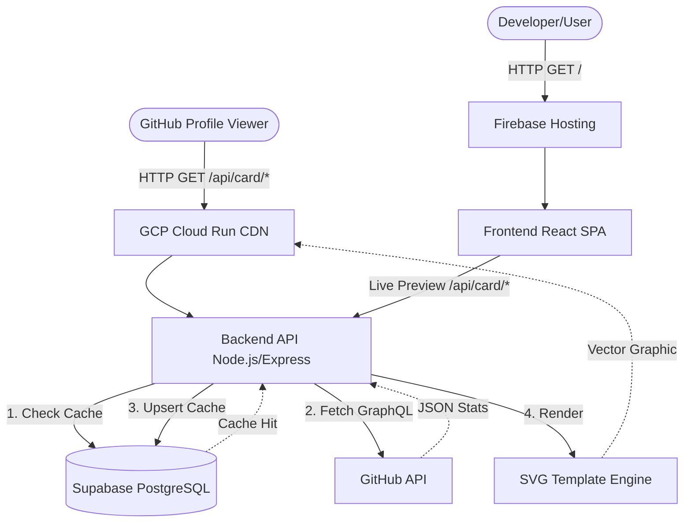
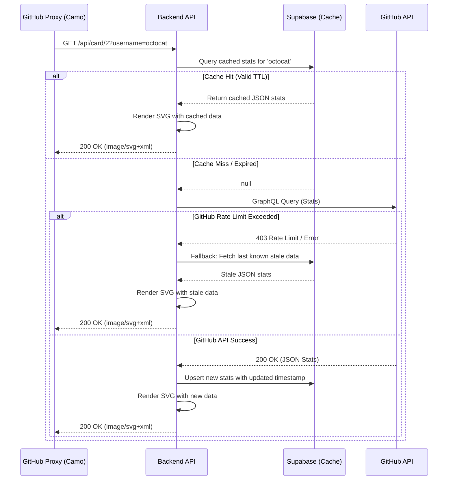

# System Architecture

This document provides a detailed overview of the system architecture for **GitHub Neon Stats Cards (GithubReadmeStatsV2)**. It outlines the core components, data flow, sequence diagrams, and technology choices that power the dynamic SVG generation and caching mechanisms.

---

## 1. High-Level System Overview

The system is composed of two primary components decoupled from each other:
1. **Frontend Dashboard**: A static Single Page Application (SPA) where users customize their SVG cards and preview them in real-time.
2. **Backend API**: A Node.js service that handles fetching GitHub data, caching it, rendering dynamic SVGs, and serving them as images.

---

## 2. Core Components

### 2.1 Backend API (SVG Generator)
The backend is a stateless Express.js application designed to quickly serve dynamic SVG images. Since GitHub's Camo proxy heavily caches and requests images on behalf of users, the backend must be extremely fast and resilient to rate limits.

**Key Modules:**
*   **Routing (`routes/card.js`, `routes/stats.js`)**: Maps URLs like `/api/card/2?username=octocat` to specific card templates and data requirements.
*   **GitHub Service (`services/github.js`)**: Executes precise GraphQL queries to fetch only the necessary data (stars, commits, languages) to minimize payload size and API cost.
*   **Cache Layer (`services/cache.js`)**: Interfaces with Supabase. It implements a stale-while-revalidate pattern or standard TTL (Time To Live) to ensure GitHub API rate limits (5,000 req/hr) are never breached.
*   **Renderer (`services/renderer.js`)**: Parses raw SVG templates from the `templates/` directory and injects dynamic data, colors, and text into the XML structure before sending the final `image/svg+xml` response.

### 2.2 Frontend (Live Customizer)
The frontend provides a visual interface for users to generate the exact Markdown or HTML needed for their `README.md`.

**Key Modules:**
*   **Vite + React 19**: Provides a lightning-fast development environment and optimized production bundle.
*   **Component Architecture (`src/components/`)**: Clean separation between the Hero/Landing page (`HeroPage.jsx`), Navbar (`Navbar.jsx`), and the core Editor (`EditorPage.jsx`).
*   **SVG Parser (`src/utils/svgParser.js`)**: Parses templates dynamically on the client side for live-preview rendering without hitting the backend API repeatedly during customization.

---

## 3. Data Flow & Sequence

The most critical flow in the application is the SVG rendering sequence. To maintain high performance and prevent API bans, the backend strictly orchestrates caching and fallback mechanisms.

---

## 4. Tech Stack Details

| Domain | Technology | Justification |
| :--- | :--- | :--- |
| **Backend Framework** | Node.js + Express 5 | Lightweight, highly performant for async I/O, perfect for proxying API requests and serving SVGs. |
| **Frontend Framework** | React 19 + Vite | Vite provides instant HMR. React 19 handles complex state management in the visual editor efficiently. |
| **Styling** | Tailwind CSS 4 + DaisyUI | Utility-first CSS allows rapid prototyping of the dashboard. DaisyUI provides pre-built, accessible components. |
| **Database/Cache** | Supabase (PostgreSQL) | Fully managed Postgres with a RESTful interface. Serves as a persistent cache to bypass GitHub API limits. |
| **Deployment (API)** | GCP Cloud Run | Serverless container execution. Scales automatically to 0 when idle, handles massive traffic spikes gracefully. |
| **Deployment (Web)** | Firebase Hosting | Global CDN caching for static assets, providing sub-second load times for the SPA. |

---

## 5. Security & Rate Limiting

*   **Token Protection**: The GitHub Personal Access Token (PAT) is strictly stored as a server-side environment variable and is never exposed to the frontend.
*   **CORS Configuration**: The backend restricts API access appropriately, ensuring that only allowed origins (or GitHub's camo proxy) can render cards if required.
*   **Rate Limits**: The 4-hour cache TTL ensures that even if a single user's `README.md` is viewed 10,000 times a day, only 6 requests reach the GitHub API.
